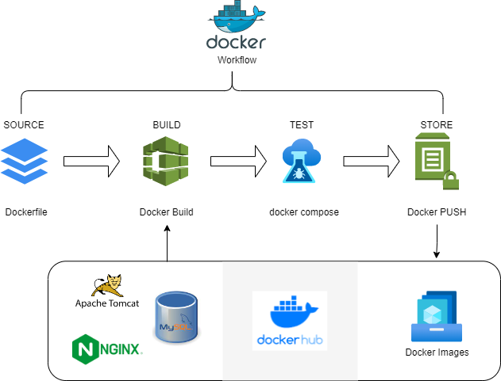

# Docker
#
### Notes
- Docker manages your Containers
- main strength are its images
- A standard unit of software; package software into standardized units for development, shipment, and deployment

### Containerizing project

###### ./ContainerizingProject/
- We replicated the same setup for ../vprofile-project/ but used Docker for provisioning
###### ./ContainerizingProject/app/Dockerfile
- RUN - remove all files from tomcat webaps
- COPY - copy the war file into the tomcat webapps folder as ROOT.war
- EXPOSE - we expose the port that tomcat will run on
- CMD - running catalina.sh will run the tomcat process, it's pre-defined in the tomcat image
- WORKDIR - setting the directory to tomcat subdirectory
- VOLUME - attaching any local volume to my host machine directory
###### ./ContainerizingProject/db/Dockerfile
- ENV - adding an environment variable for required password and db account name
- ADD - adding the premade sql file and pushing it into a specific location
###### ./ContainerizingProject/web/Dockerfile
- RUN && COPY - we remove the default config file and copy our own built configuration file in the same location
	- For configuration file nginvproapp.conf, we have the server listen for traffic on port 80 and forward the requests to and upstream server on port 8080, where our tomcat server will be running
1. Once set, ran maven install on a pom.xml file to get the vprofile-v2.war and set the file within /app/
2. ran "docker build -t juntheyi/tomcat:V1 ."
	- building the image and reflecting the same parameters in docker hub repository for junetheyi repo named tomcat and tag of V1. The "." represents the location within current working instance.
3. same for db and web
4. used "docker pull memcached" to pull memcached image, we can do this because no customization needed.
	- same with "docker pull rabbitmq"
5. Created docker-compose.yml file with some notes on following settings
	- name of containers falling under services: need to reflect as we had in applications.properties file for db that we used for our pom.xml
	- for nginx file, needs to reflect same as the customized Dockerfile for web
	- for db exposed port, we use docker inspect <imageName> to see which port is exposed in the image
	- for volumes we mapped the mysql db to vprodbdata to not lose our data
6. docker-compose up
7. pushed all customized images to dockerhub repo

### Docker Compose
###### ./Dockertest/
- tool for defining and running multi-container docker applications
- similar to "vagrant up" you can use "docker-compose up"
- files are written in .yml
###### ./Dockertest/Dockerfile
- uses python alpine image from docker hub
- WORKDIR /code - where all files will be placed for later cmds to come
- COPY - we copy the local requirements.txt file into the container (in WORKDIR /code)
- we run pip install -r requirements.txt
- COPY . . - is copying everything in the current directory into the container at the specified WORKDIR
###### ./Dockertest/docker-compose.yml
- file is self-explanatory, use https://docs.docker.com/compose/gettingstarted/ if you'd like more specific details
- "docker compose up" to build

### Entrypoint and CMD
###### example #1
- FROM ubuntu:latest
- CMD ["echo", "hello"]
	- prints hello when you run the image
###### example #2
- FROM ubuntu:latest
- ENTRYPOINT ["echo"]
	- runs echo, prints an empty line.
	- user can run the argument in this instance
	- docker run <imageName> <argument>
###### example #3
- FROM ubuntu:latest
- ENTRYPOINT ["echo"]
- cmd ["hello"]
	- prints hello
	- but, argument can be overwritten here
	- docker run <imageName> <argument>
		- prints <argument>
	- this means it'll have a default argument that can be overwritten

### Building images
- Dockerfile builds images
###### ./DockerfileImage ([...Image] added for unique id purposes, actual file will need to be labeled Dockerfile)
- FROM - used to label the base image we want to use
- LABEL - we add labels such as author and project name
- ENV - to make the build non interactive we can set it as DEBIAN_FRONTEND=noninteractive 
	- if any interaction is needed, the build will fail
- RUN - execute commands we want to run such as downloading required packages
- CMD - we used exec form, (3 different forms total), which does not invoke a command shell. Thus, we need to express the command as a JSON array and give full path to the executable.
- EXPOSE - port that the process is running at must be stated
- WORKDIR - if we attach anything or run any docker exec commands, it'll be running directly from this directory
- VOLUME - to specify the destination of a volume inside a container
- ADD - relative path of file to path we want to add it to, add will untar a tar.gz file
- COPY - just moves the file to file destination
- docker build -t nanoimg .
	- build our image with -t as a tag identifier and "." representing the current directory of our Dockerfile
- Commands
	- docker run -d --name nanowebsite -p 9080:80 nanoimg
		- d for background, name for what we call the container, p for specifying localhost port, nanoimg being the image we choose to run
	- docker build -t <dockerhubRepoName>/<imageName>
		- to host the file on the docker repository
	- docker login
		- to login to docker acct
	- docker push <dockerhubRepoName>/<imageName>
		- pushes the image to dockerhub
- with the docker pushed to the public repo, anyone w/internet access can pull junetheyi/nanoimg to run their own container with nanoimg

### Docker Volumes
- Containers are volatile, when you make changes, you have to reboot the image and it restarts. We have volumes for containers where data needs to persist--e.g. databases
- Volumes is a wrapper in the docker volumes directory that you can attach to your container; it'll remain safe on your host machine (/var/lib/docker/volumes)
- Bind Mounts is similar to vagrant sync directory, you can take any directory from host machine and map it to a container directory; you can make changes from your host directory and it'll be reflected in your container directory
- Commands
	- docker run --name vprodb -d -e MYSQL_ROOT_PASSWORD=123 -p 3030:3306 -v /home/ubuntu/vprodbdata:/var/lib/mysql mysql:5.7
		- name: vprodb
		- -d for running in background
		- -e to set a variable thats required or it wont run (can see whats required in the documentation for the image)
		- -p to set a port
			- we used docker inspect mysql:5.7 to read the json file where it show what port mysql runs on (3306)
			- -v lets docker manage the storage of db data by writing the db files to disk on host system. before we ran this command we used mkdir to created a filepath
		- mysql:5.7 the image we're going to run
	- docker exec -it vprodb /bin/bash
		- lets us log into the container to run commands
	- docker volume
		- lets you see all the different commands you can use
	- docker volume create <volumeYouWantToName>
		- creates a volume for you to store
	- docker run --name vprodb -d -e MYSQL_ROOT_PASSWORD=123 -p 3030:3306 -v <volumeYouNamedEarlier>:/var/lib/mysql mysql:5.7
		- simpler way to direct container data to a pre-set volume
		- volume is stored in /var/lib/docker/volumes/<volumeYouNamedEarlier>/
	- docker inspect <container>
		- gives you specific information on the container you started
	- mysql -h <ipOfContainer> -u root -p<password>
		- gets into mysql container running and execute mysql commands

### Docker Image + Logs
- A stopped container like vm image
- container runs from images; you can't remove the image when its running
- images in registries are called repositories
- Registries:
	- Cloud based - dockerhub, GCR (Google), ECR (Amazon)
	- Local - Nexus 3+, Jfrog Artifactor, DTR
- Can run multiple containers on an image
- commands i used:
	- sudo usermod -aG docker ubuntu
		- provide ubuntu (username) user sudo access for docker specific commands
		- alternate way is: sudo vim /etc/group
			- then add user name to application you want them to have sudo access
	- docker images
		- see all images that have been pulled
	- docker run <imagename>
		- run the image on a container
	- docker run --name <whatevernameyouwanttocallit> -p 7090:80 -d <imagename>
		- runs docker image with -p to specify a local port and -d to run it in the background
			- images that run constantly like web servers will pull you out of bash and you'll have to use ctrl+c to exit which will also stop the image running
	- docker inspect <imagename>
		- can inspect the image in json format
	- docker run -d -P nginx
		- will run the image on a localhost automatically
	- docker run -d -P <imageyouhaven'tpulledyet>
		- if you don't have the image, docker will search dockerhub and download the image for you
	- docker logs
		- see the output of logs from when docker starts the images you run
	- docker ps
		- see all running containers
	- docker ps -a
		- see all containers you have ran that are live and dead
	- something neat, if you run an application image like ubuntu, it's not persistent like nginx, so you can use commands like "docker exec -it <imagename> /bin/bash" to start bash and then run commands in that image while its running
	- docker rmi
		- removes images
	- docker rm
		- removes containers
	- /var/lib/docker/
		- contains docker files

### Docker Setup
- All on the website; very simple - https://docs.docker.com/get-docker/

#### Random Notes
- Isolating and hosting infrastructure results in high CapEx and OpEx due to cost of VMs
	- Every VM has OS, OSs need nurturing, licensing, and take time to boot; they can get bulky fast when multiple are required. Some require high amount of resources.
- Imagine multiple services running in the same OS but isolated
- Container
	- A standard unit of software; package software into standardized units for development, shipment, and deployment
	- process running on same OS but still isolated
	- Containers share the machine's OS system kernel
	- contains all the code and dependencies
	- Containers offer isolation, not virtualization; containers are OS virtualization
	- VMs are Hardware virtualization; VM needs OS
	- Containers don't need OS; Containers uses Host OS for compute resources