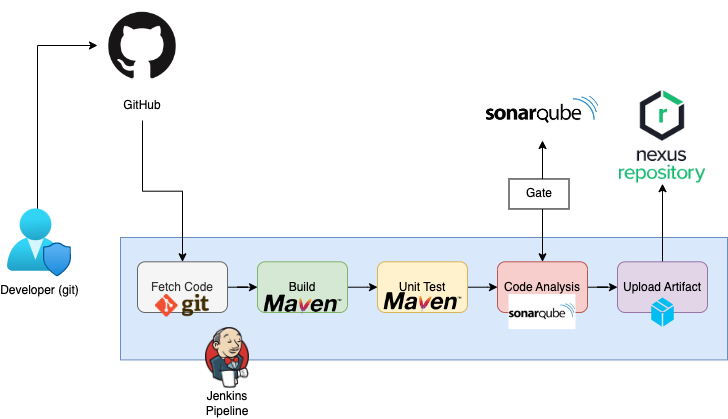

# Jenkins
#
### Notes
- open source and extensible
	- extensible = limitless plugins: VCS plugins, Build plugins, Cloud plugins, Testing plugins
- pre-req: Java, JRE, JDK, any OS
- Experimented with versioning, plugins, global configuration tools and local config tools
- Automate pipeline setup with Jenkinsfile
	- Jenkinsfile defines Stages in CI/CD pipeline
	- its a text file with its own domain specific language (DSL) - similar to groovy
	- 2 syntax - declarative and scripted

### Continuous Integration Pipeline
1. Dev uses git --> pushes to repo
2. Jenkins detects change and fetches code with a git tool
3. Code will build using tool like Maven
4. Unit Test will be conducted with tool like Maven
5. Code Analysis conducted by tool like SonarQube, checkstyle
	- checks for vulnerabilities/bugs/best practices
	- generates reports in .xml, uploaded to a server
6. Distributes the artifact to be deployed on server and versioned on NexusOSS Sonartype repo
7. Publish Docker images and store on Amazon ECR
8. Use Amazon ECS to host the application/image

### Setup
- Created unique instances for Jenkins, SonarQube, Nexus and used shell script from vprofile-project-ci-jenkins/userdata/
- For Jenkins, used the following plugins: 
	- Nexus Artifact Uploader - This plugin to upload the artifact to Nexus Repository.
	- SonarQube Scanner - This plugin allows an easy integration of SonarQube, the open source platform for Continuous Inspection of code quality.
	- Build Trigger Badge - This plugin displays an icon representing the cause of a construction.
	- Build Timestamp - This plugin adds BUILD_TIMESTAMP to Jenkins variables and system properties.
	- Pipeline Maven Integration - This plugin provides integration with Pipeline, configures maven environment to use within a pipeline job by calling sh mvn or bat mvn. The selected maven installation will be configured and prepended to the path.
	- Pipeline Utility Steps - Utility steps for pipeline jobs.

### Using JenkinsFile (Declarative pipeline - Pipeline as a Code)
- Followed standard formatting for Jenkinsfile (located in this directory)
- developed stages with each stage being a specific part of the build
- ran into an error with downloading jdk from oracle so used "sudo apt-get --yes install openjdk-8-jdk"
	- Jenkins requires sudo permissions for this action as the user
		- Used command "visudo -f /etc/sudoers.d/jenkins" to adjust permissions
		- Added this line : jenkins ALL=(ALL) NOPASSWD: ALL
		- We can create a file inside of the /etc/sudoers.d directory instead of modifying the base sudoers file. This keeps the primary sudoers file clean and prevents any conflicts or errors during an upgrade. All files inside of the /etc/sudoers.d directory will be automatically included thanks to this command at the bottom of your sudoers file
- Changed tool home in jdk global config to:
/usr/lib/jvm/java-8-openjdk-amd64
- This took me 6 hours to figure out, made me want to puke

### Code Analysis
- After Fetch Code --> Build --> Unit Test; we now move to Code Analysis
- We use SonarQube
- Using SonarQube plugin from setup, we add installation with a name
- add SonarQube from within configure systems; add sonar URL from ec2 instance hosting SQ
- Generate token from sonarqube, login, go to account, security, generate token, add that to jenkins settings
- Created JenkinsfileWSonarQube
- Quality Gates
	-added quality gate stage with a hour long timeout block; it waits for a quality gate defined on the sonarqube server
	- select quality gates tab on SQ server
	- create, define conditions
	- go to projects, and linke the quality gate you just create
	- once selected, you'll need webhooks to send the information
		- http://<ip>:<port>/sonarqube-webhook/

### Nexus
- A software repository - your own repo for sotwares/pkgs
	- e.g. for storing maven dependencies, apt, yum, nuget, npm, docker images...etc.
- An automation stream can pull artifacts in the nexus repo and deploy to the new server
- repository types:
	- (hosted) for storing
	- (proxy) for downloading dependencies
	- (group) group both repos
- Create a repository (maven2-hosted), artifacts from jenkins will be stored there; set up credentials in jenkins so it can talk to nexus
- Bonus: Slack notification plugin
	1. Create a separate channel; add Jenkins CI app to slack in their app settings; add created channel name
		- store the token
	2. Install slack plugin in Jenkins; go to configurations and add credentials w/token
	3. added a post notification to Jenkinsfile that shows stats w/ a message
		- currentBuild.currentResult with a color map assigned to it. the text will show green if success and red if failure
		- message will show job name, build number, and a url link to the job

### Docker Integration w/ Amazon ECR
1. logged in as root user in Jenkins EC2; installed docker enginer using CLI frmo website
2. adding jenkins id/user to dockers group
	- usermod -aG docker jenkins
3. Created IAM user with full access to ECS and ECR
4. Created private Amazon ECR
5. Added following plugs in Jenkins:
	- AWS SDK::All
	- Amazon ECR
	- Docker Pipeline
	- CloudBees Docker
6. Add AWS credentials to global creds on Jenkins
7. Update Jenkins file with appropriate info (mostly in environment tag)
8. Build

### Amazon ECS
- After we containerized our application (creating a docker image), we need to host it somewhere. We can host it on docker...but managing the platform would be difficult due to lack of production features--this is where k8 shines
	- Other options: EKS, AKS, GKE, Openshift, etc
- Can also use Amazon ECS: Docker container hosting platform
1. Create cluster on ECS
2. Use task definitions to mention the image that needs to be fetched from ECR
3. Run on fargate for now, added ECR image and URL
4. Create a service to deploy on ECS clusters
5. Add a LB with new SG
6. Installed Pipeline AWS Steps plugin on jenkins

### Job Triggers
- Popular triggers - Git Webhook, Poll SCM, Scheduled jobs, remote triggers, Build after other projects are built

