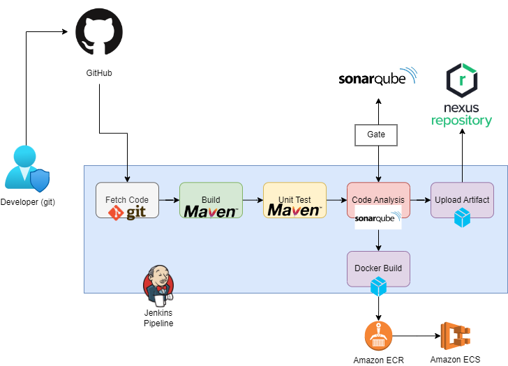

# Jenkins
#
### Notes
- open source and extensible
	o extensible = limitless plugins: VCS plugins, Build plugins, Cloud plugins, Testing plugins
- pre-req: Java, JRE, JDK, any OS
- Experimented with versioning, plugins, global configuration tools and local config tools
- Automate pipeline setup with Jenkinsfile
	o Jenkinsfile defines Stages in CI/CD pipeline
	o its a text file with its own domain specific language (DSL) - similar to groovy
	o 2 syntax - declarative and scripted

### Continuous Integration Pipeline
1. Dev uses git --> pushes to repo
2. Jenkins detects change and fetches code with a git tool
3. Code will build using tool like Maven
4. Unit Test will be conducted with tool like Maven
5. Code Analysis conducted by tool like SonarQube, checkstyle
	- checks for vulnerabilities/bugs/best practices
	- generates reports in .xml, uploaded to a server
6. Distributes the artifact to be deployed on server and versioned on NexusOSS Sonartype repo

### Setup
- Created unique instances for Jenkins, SonarQube, Nexus and used shell script from vprofile-project-ci-jenkins/userdata/
- For Jenkins, used the following plugins: 
	o Nexus Artifact Uploader - This plugin to upload the artifact to Nexus Repository.
	o SonarQube Scanner - This plugin allows an easy integration of SonarQube, the open source platform for Continuous Inspection of code quality.
	o Build Trigger Badge - This plugin displays an icon representing the cause of a construction.
	o Build Timestamp - This plugin adds BUILD_TIMESTAMP to Jenkins variables and system properties.
	o Pipeline Maven Integration - This plugin provides integration with Pipeline, configures maven environment to use within a pipeline job by calling sh mvn or bat mvn. The selected maven installation will be configured and prepended to the path.
	o Pipeline Utility Steps - Utility steps for pipeline jobs.
- AutoJenkinsfile defines

###
