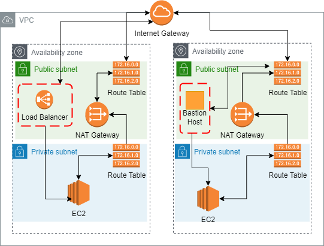

# VPC Architecture
#

1. Created a VPC with IPv4 CIDR 172.20.0.0/16
	- 172.20.0.0 represents a private IP address in accordance with the standards set by IANA
	- the /16 represents a CIDR notation expressing a subnet mask of 255.255.0.0
		- this means we have everything from 172.20.0.0 to 172.20.255.255 available for usage
			- thats 65,534 if we don't count the broadcast IP address and network identification IP address
2. Created 4 subnets; 2 for public and 2 for private
	- 172.20.1.0/24
	- 172.20.2.0/24
	- 172.20.3.0/24
	- 172.20.4.0/24
	- subnets created evenly separated between 2 availability zones for HA (east-1a, east-1b)
	- The /24 represents a subnet mask of 255.255.255.0 meaning we have 254 IP addresses available in each created subnet
	- Note: They're not public nor private yet until they're connected to a specific route table which I'll do in step 4
3. Created an Internet Gateway for the VPC to connect to the public internet
4. Created a Route Table and connected it to 2 subnets which I selected to to be public.
	- When route table is created, it only has route traffic to the VPC I chose--172.20.0.0/16
	- I then added a public destination 0.0.0.0/0 with target of the Internet Gateway (IG); so any traffic that's looking to go somewhere public will be routed to the IG
5. We then created a NAT gateway for the private subnets to connect to
	- This makes it so that we can send traffic FROM the private subnets TO the public but at the same time PREVENT incoming/returning traffic
	- We attached an Elastic IP so that the address remains static
	- This NAT gateway will also reside in one of the public subnets we created
6. Created a second route table, this one for the 2 subnet selected to be private
	- we set the destination for any public traffic to be the NAT Gateway
7. Created an EC2 instance
	- selected the created vpc
	- selected private subnet
		- we want the server (and all other instance) in the private subnet
		- the load balancer will be located on the public subnet and will funnel traffic to the respective servers
	- Created a new SG that will default to the vpc it resides in
8. Created a Bastion Host that will have access to the EC2 instance
	- Selected the created vpc
	- Selected a public subnet to be accessible by public
	- Used a harden AMI from CIS (Center for Internet Security)
	- New SG within the VPC as well
9. Updated EC2 security group to allow inbound port 22 from Bastion Host private IP
10. Tested connection by ssh into the Bastion Host
11. Once successful, logged back out and used scp to upload the correct key for the ec2 into the bastion host server
	- scp is Secure Copy Protocol that uses port 22 to securely transfer files between two hosts
	- scp -i <keyUsedForBastion> <keyWeWantToCopy> ec2-user@ec2-<ip>.compute-1.amazonaws.com:/home/ec2-user/
12. Once in, use key to ssh into ec2 web server
13. Then we created a Load Balancer to direct incoming traffic into the ec2 web server
	- listens on port 80
	- created its own security group with http traffic
	- resides in created vpc
	- resides on both the 2 public subnets
14. Selected ec2 web server security group and allowed inbound traffic from port 80 coming from the Load Balancer security group

Bonus:
- VPC Peering
	- Create a VPC in a completely different region
	- Once created, select Peering Connection on the list of options in the AWS VPC page
	- Allows for connection between other VPCs
- Network ACL
	- As security groups are for instances, NACL are for the subnet traffic
	- Similar to security groups, you choose what traffic to allow, however, NACLs go further and you can select specific type of traffic to deny
	- The rules generally are numbered by the 100s, with the priority going to the lowest number first
		- e.g. you can make rule 100 with deny to a specific IP address, then rule 200 with allow all traffic. the NACL will allow all traffic except for what is stated in rule 100 since that rule takes priority. If it was reversed than all traffic would prioritized the blocked traffic rule.